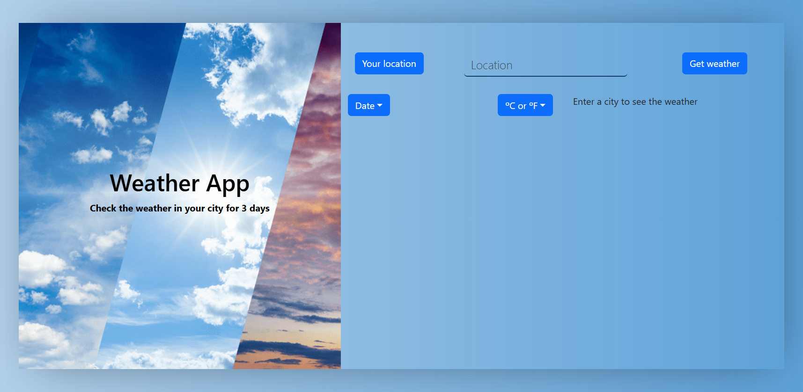
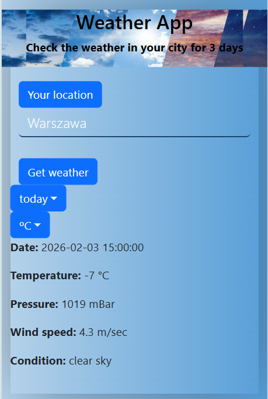

# ☀️ Weather App

A responsive **weather forecast application** built with **Vite, React, and TypeScript**.  
Search for a city or use your current location to view a **3-day weather forecast**, choose the day, and switch between **°C / °F** units.

### 🔗 Live Demo
👉 https://weather-app-vm.web.app

---

## ✨ Features

- 🌍 Search weather by city name
- 📍 Get weather using **current geolocation**
- 🗓 Select forecast day (up to 3 days)
- 🌡 Switch between **Celsius / Fahrenheit**
- 🕘 Last **5 searched cities** saved in localStorage
- ⚠️ User-friendly validation & error messages
- 📱 Fully responsive layout (desktop, tablet, mobile)

---

## 🛠 Tech Stack

- **Frontend:** React, TypeScript, Vite
- **State & Logic:** Custom React hooks
- **Weather API:** OpenWeatherMap
- **Storage:** localStorage (search history)
- **Styling:** CSS / Bootstrap grid

---

## 📸 Screenshots

### Desktop View



### Mobile View



---

## 🚀 Getting Started

### Install & Run Locally

```bash
npm install
npm run dev
